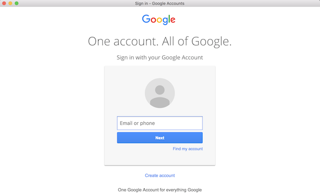
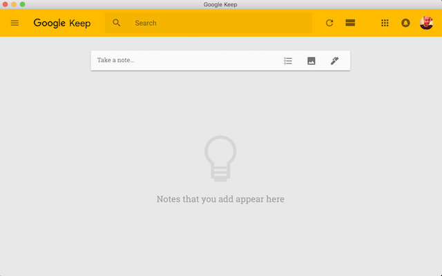

# An A-B-C to Electron App (when you hate to use Google Keep inside browser tab).


## Requirement:

 - Node.JS
 - Terminal

## Yada yada yada:

1. Make a repo in Github named gKeep (without README).
2. In Terminal -
	1. Create project dir and cd into it.
	
	    ```
	    > mkdir gKeep && cd gKeep
	    ```

	2. Initialize npm project.

		```
		> npm init
		```

	    ```
	    package name: (gkeep)
	    version: (1.0.0)
	    description: Gooogle Keep, wrapped as an electron app.
	    entry point: (index.js) 
	    test command:
	    git repository: https://github.com/gihub_user_name/gKeep.git
	    keywords: Google Keep Electron App
	    author: your_name
	    license: (ISC)
	    ```

		Update `package.json` created by npm project initialization.
		
	      ```javascript
	      "scripts": {
		  "test": "echo \"Error: no test specified\" && exit 1",
		  "start": "electron ."
	      }
	      ```

	3. Install Electron library as dev-dependenct
	
		```
		npm i -D electron
		```
    
    4. Create README

	    ```
	    > touch README.md
	    ```
	

	
	5. Initialize local git repo.
	
	    ```
	    > git init
	    > git add .
	    > git commit -m "project initiated"
	    ```

	5.  Push to Github repo.

	    ```
	    > git remote add origin https://github.com/gihub_user_name/gKeep.git
	    > git push -u origin master
	    ```

	6. Create index.js
		
		```
		> touch index.js
		```
		
		`index.js:`

		```javascript
		const electron = require('electron');
		const app = electron.app;
		const BrowserWindow = electron.BrowserWindow;
		
		let mainWindow = null;
		
		app.on('ready', function () {
		  // Get display monitor/screen size
		  let monitorScreenSize = electron.screen.getPrimaryDisplay().size;
		
		  // Create a window sized down to 80% of display monitor/screen size
		  mainWindow = new BrowserWindow({
		    'width': monitorScreenSize.width * .8,
		    'height': monitorScreenSize.height * .8
		  });
		
		  // Load google keep from URL in the above window
		  mainWindow.loadURL('https://keep.google.com');
		
		  // Destroy windown when closed
		  mainWindow.on('closed', function () {
		    mainWindow = null;
		  });
		});
		
		// Quit App when all windows are closed.
		app.on('window-all-closed', function () {
		  // On OS X it is common for applications and their menu bar
		  // to stay active until the user quits explicitly with Cmd + Q
		  if (process.platform != 'darwin') {
		    app.quit();
		  }
		});
		``` 


				
	7. Test run.

	      ```
	      > npm start
	      ```

      		A window will open asking for user credential to login to Google  Accounts to run Keep.
		
		  
		
		  After login:
		
		  	
    
  	8. Commit changes and push   	

## Add features:

Store window size and position on exit. Restore and apply on load.

1. Install electron-window-state package

  ```
    npm i -S electron-window-state
  ```
2. Update `index.js`

  `index.js:`

  ```javascript
  const electron = require('electron');
  const app = electron.app;
  const BrowserWindow = electron.BrowserWindow;
  const windowStateKeeper = require('electron-window-state');

  let mainWindow = null;

  app.on('ready', function () {
    // Get display monitor/screen size
    let monitorScreenSize = electron.screen.getPrimaryDisplay().size;

    // Load the previous state with fallback to default(sized down to 80% of display monitor/screen size)
    let mainWindowState = windowStateKeeper({
      defaultWidth: monitorScreenSize.width * .8,
      defaultHeight: monitorScreenSize.height * .8,
    });

    // Create a window using the state information
    mainWindow = new BrowserWindow({
      'x': mainWindowState.x,
      'y': mainWindowState.y,
      'width': mainWindowState.width,
      'height': mainWindowState.height
    });

    // Register listeners for window size, position change logging
    mainWindowState.manage(mainWindow);

    // Load google keep from URL in the above window
    mainWindow.loadURL('https://keep.google.com');

    // Destroy windown when closed
    mainWindow.on('closed', function () {
      mainWindow = null;
    });
  });

  // Quit App when all windows are closed.
  app.on('window-all-closed', function () {
    // On OS X it is common for applications and their menu bar
    // to stay active until the user quits explicitly with Cmd + Q
    if (process.platform != 'darwin') {
      app.quit();
    }
  });
  ```

3. Test run.

      ```
      > npm start
      ```

## Packaging and Distribution

- electron-packager will be used for packaging
- electron-icon-maker will be used to make native icon file from png

```
npm i electron-packager electron-icon-maker -g
```

### Convert png file to native icon format:

```
electron-icon-maker -i=keep-icon.png
```

Converted Icons will be in icons directory.

### Package

```
electron-packager . --overwrite --icon icons/mac/icon.icns --out dist
```

Package will be created under dist directory.
